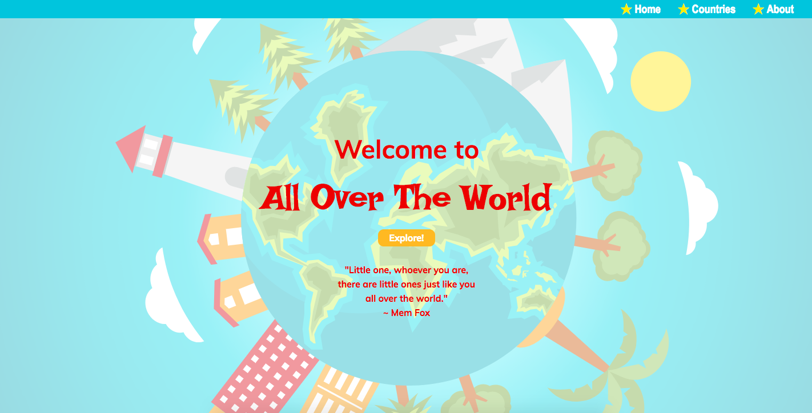
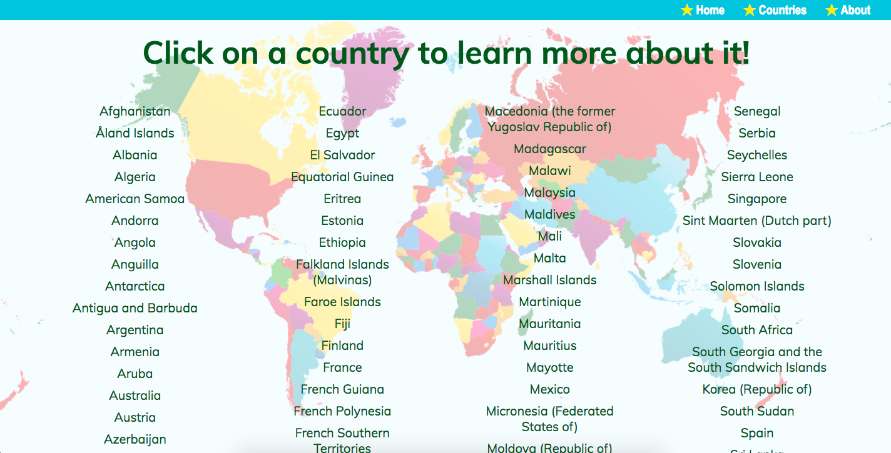
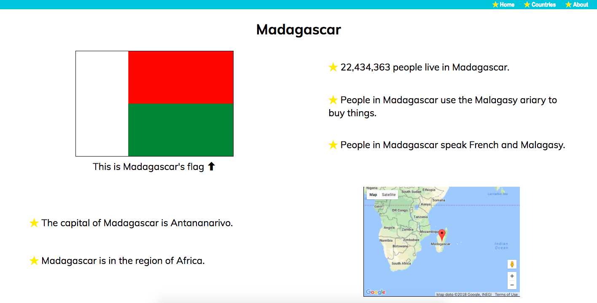
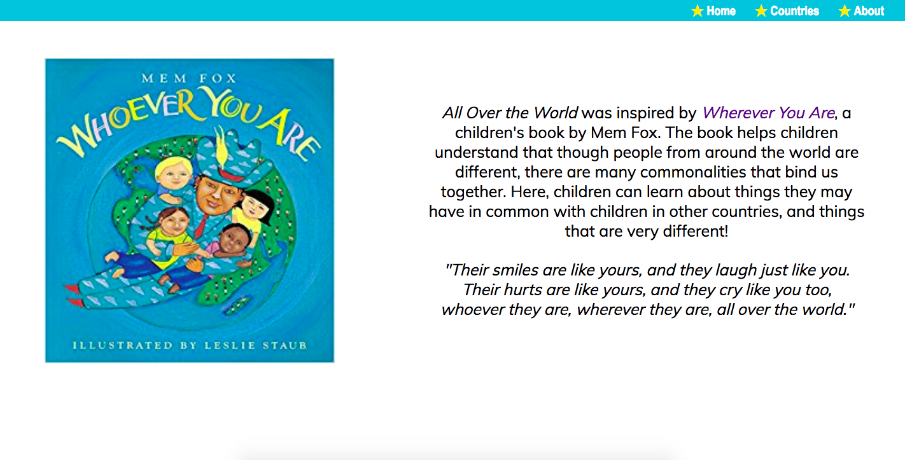
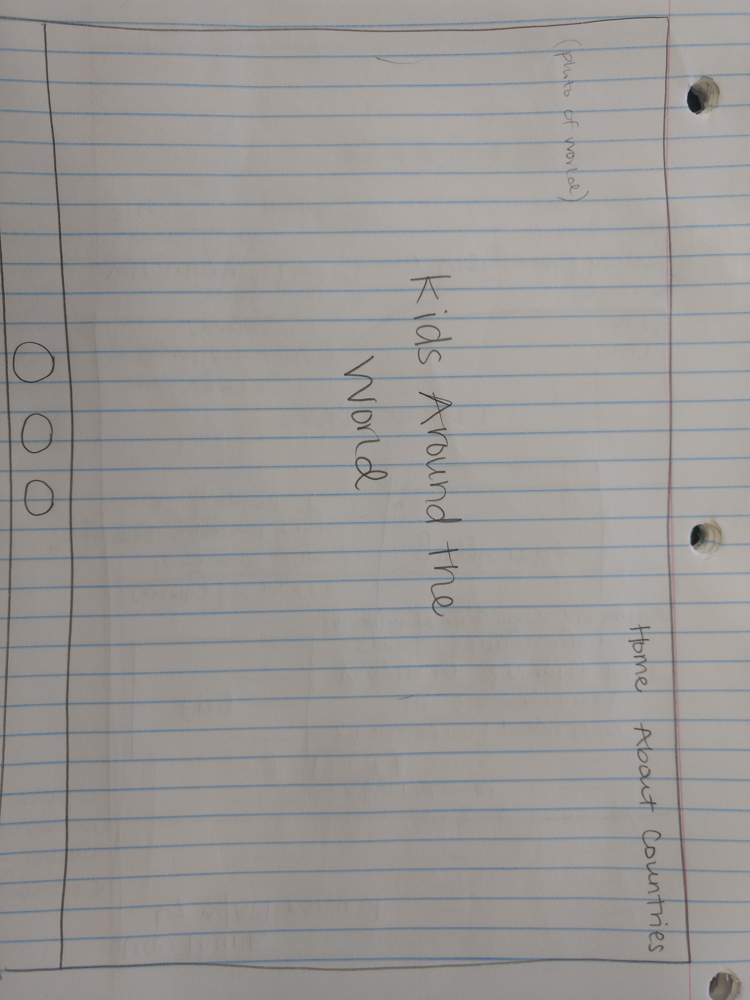
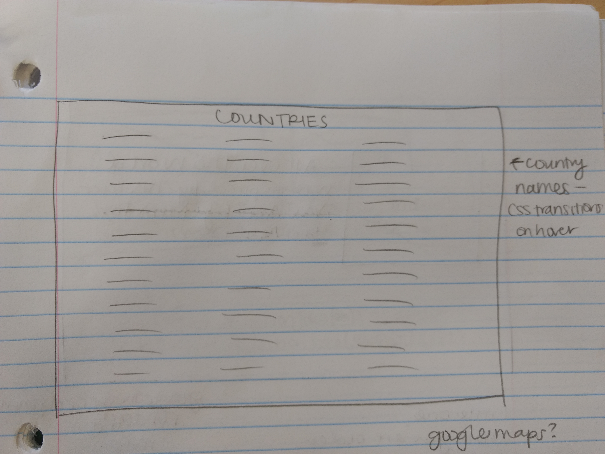
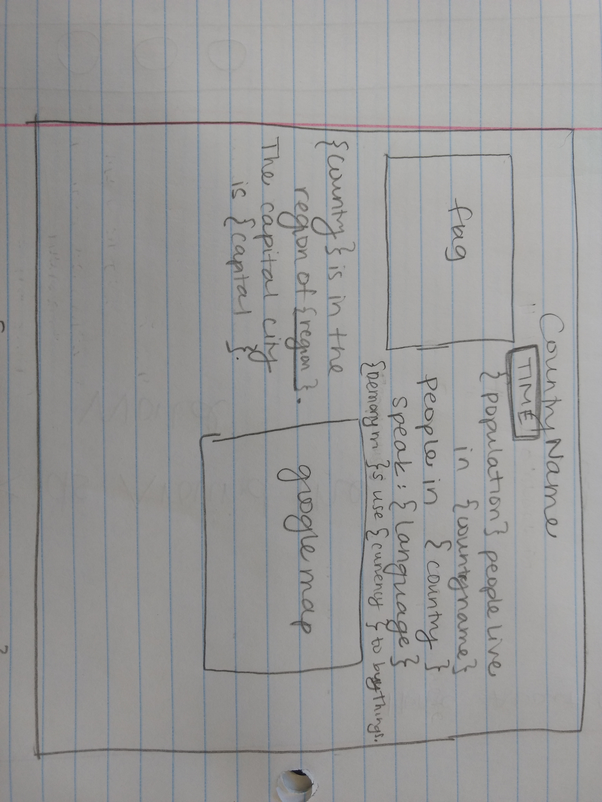
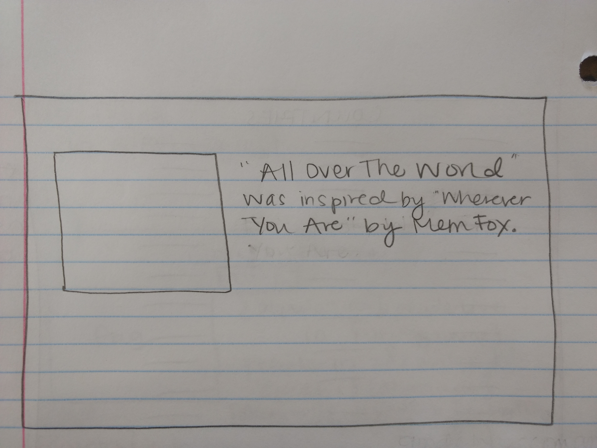

# All Over The World - React/Redux with API Integration

## Objectives

1) Build an educational website with a child-friendly interface. Help children become familiar with countries around the world.

2) Meet the following assignment requirements:
  * Online API integration
  * 3 page views using React Router
  * Responsive

### Homepage

### Countries

### Individual Country Page

### About Page

## Technologies Used
* React
* JavaScript
* HTML
* CSS
* React Router
* Redux
* AJAX
* Axios + Thunk

## Wireframes
 
 

## Code Snippets

Made API requests 

This project was bootstrapped with [Create React App](https://github.com/facebookincubator/create-react-app).
